<h1 align="center">
    Safe Vibe Coding 🛡️✨
</h1>
<p align="center">
    <p align="center">
    <a target="_blank" href="https://github.com/sarthakrastogi/safe-vibe-coding">
        
    </a>
    </p>
    <p align="center">A comprehensive guide for non-technical creators who want to code safely while maintaining their creative flow
    <br>
    </p>
<h4 align="center">
    <a href="https://github.com/sarthakrastogi/safe-vibe-coding" target="_blank">
        
    </a>
    <a href="https://github.com/sarthakrastogi/safe-vibe-coding/blob/main/LICENSE">
        
    </a>
</h4>

---

## Table of Contents

1. [Introduction](#introduction)
2. [What is Vibe Coding?](#what-is-vibe-coding)
3. [Why Security Matters for Creative Coders](#why-security-matters-for-creative-coders)
4. [Essential Security Concepts Made Simple](#essential-security-concepts-made-simple)
5. [Protecting Your Secrets: Environment Variables and API Keys](#protecting-your-secrets-environment-variables-and-api-keys)
6. [Safe Authentication Using Third-Party Tools](#safe-authentication-using-third-party-tools)
7. [Security Checklist for Every Project](#security-checklist-for-every-project)
8. [Common Mistakes and How to Avoid Them](#common-mistakes-and-how-to-avoid-them)
9. [Recommended Tools and Services](#recommended-tools-and-services)
10. [Emergency Response: What to Do When Things Go Wrong](#emergency-response-what-to-do-when-things-go-wrong)
11. [Building Security Habits](#building-security-habits)

---
## Primer
If you prefer to first read a summary of this guide, read this 2-min post (recommended):

[](https://sarthakai.substack.com/p/the-guide-to-safe-vibe-coding?r=17g9hx&triedRedirect=true)
---

## Introduction

Welcome to Safe Vibe Coding! This guide is designed specifically for creative minds, hobbyists, and non-technical builders who want to bring their ideas to life through code without compromising on security.

Every amazing project deserves to be protected. Not because you're paranoid, but because you're building something that matters.

---

## What is Vibe Coding?

Vibe coding is about maintaining your creative energy while building. You know that feeling when you're in flow state, ideas are clicking, and code is just flowing? That's vibe coding.

**Safe vibe coding** means you get to keep all that creative energy while building in protection that works behind the scenes.

#### Why Security Matters for Creative Coders


---

## Protecting What You Build

Your projects represent hours, days, maybe months of creative work. Here's what good security practices actually protect:

| Risk | Without Security | With Security |
|------|------------------|---------------|
| **Code theft** | Anyone can access your repositories | Private repos, access controls |
| **API abuse** | Unlimited charges on your accounts | Rate limiting, key rotation |
| **User data breaches** | Personal info exposed publicly | Encryption, proper access controls |
| **Service interruption** | Site goes down, users can't access | Backups, incident response plans |
| **Reputation damage** | Users lose trust permanently | Quick response, transparent communication |

## Quick Start Guide


**Essential Security Setup (10 minutes):**
- [ ] Create `.env` file for secrets
- [ ] Add `.env` to `.gitignore`
- [ ] Set up authentication service
- [ ] Configure HTTPS
- [ ] Enable basic monitoring

---

## Essential Security Concepts Made Simple

```mermaid
flowchart TD
    subgraph "Security Fundamentals"
        A[Authentication] --> A1["Who are you?<br/>🔑 Login with password"]
        B[Authorization] --> B1["What can you do?<br/>👮 Permission checks"]
        C[Encryption] --> C1["Protect data<br/>🔒 Scrambled information"]
        D[Secrets Management] --> D1["Hide sensitive info<br/>🗝️ API keys, passwords"]
    end
    
    style A fill:#e3f2fd
    style B fill:#fff3e0
    style C fill:#f3e5f5
    style D fill:#e0f2f1
```



### Authentication vs Authorization

| Concept | Real-World Example | In Your App |
|---------|-------------------|-------------|
| **Authentication** | Showing ID at a concert | User logs in with password |
| **Authorization** | Checking if you have VIP access | User can edit only their own posts |

### The Principle of Least Privilege


**Give each user, service, or system only the minimum access they need to do their job.**

### What Are "Secrets"?

| Type | Examples | Why They're Secret |
|------|----------|-------------------|
| **API Keys** | `sk-1234abcd...` | Give access to paid services |
| **Database Passwords** | `mySecretPassword123` | Control access to all your data |
| **Encryption Keys** | `a1b2c3d4e5f6...` | Decrypt sensitive user information |
| **OAuth Tokens** | `Bearer eyJhbGc...` | Act on behalf of users |

<details>
<summary>🔍 Deep dive: How encryption protects your data</summary>

### Encryption Explained

**Encryption in Transit** (Data traveling over the internet)
```
Your app → [🔒 HTTPS] → User's browser
Database → [🔒 TLS] → Your app
```

**Encryption at Rest** (Data stored on servers)
```
User Password: "mypassword123"
Stored in DB: "$2b$12$vI8aWBnW3fID.ZQ4/zo1G.q1lRps.9cGLcZEiGDMVr5yUP1KUOYTa"
```

Even if someone steals your database files, they can't read the actual passwords.

</details>

---

## Protecting Your Secrets: Environment Variables and API Keys

This is probably the most important section for keeping your projects safe. Let's make it bulletproof.

### The Problem: Hardcoded Secrets

```python
# ❌ NEVER do this - secrets visible to everyone
import openai
openai.api_key = "sk-1234567890abcdef..."  # Visible in your code!

# ❌ Also bad - config files with secrets
config = {
    'database_password': 'my_secret_password',  # Oops!
    'stripe_key': 'sk_live_real_key_here'       # Double oops!
}
```

**Why this is dangerous:**
- Anyone who sees your code gets your secrets
- Git history keeps secrets forever, even if you delete them later
- Copy-pasting code accidentally shares your keys
- Public repositories expose everything to the world

### The Solution: Environment Variables


<details>
<summary>🛠️ Step-by-step setup for environment variables</summary>

### Setting Up Environment Variables

**Step 1: Create your .env file**
```bash
# In your project folder, create .env
echo "OPENAI_API_KEY=your_actual_key_here" > .env
echo "DATABASE_URL=your_database_url_here" >> .env
```

**Step 2: Add .env to .gitignore immediately**
```bash
echo ".env" >> .gitignore
echo ".env.*" >> .gitignore
echo "*.env" >> .gitignore
```

**Step 3: Create a template for others**
```bash
# .env.example - safe to commit
OPENAI_API_KEY=your_openai_key_here
DATABASE_URL=your_database_connection_here
STRIPE_SECRET_KEY=your_stripe_key_here
```

**Step 4: Use in your code**

Python:
```python
import os
from dotenv import load_dotenv

load_dotenv()  # Load .env file

api_key = os.getenv('OPENAI_API_KEY')
if not api_key:
    raise ValueError("Missing OPENAI_API_KEY environment variable")
```

JavaScript:
```javascript
require('dotenv').config();

const apiKey = process.env.OPENAI_API_KEY;
if (!apiKey) {
    throw new Error('Missing OPENAI_API_KEY environment variable');
}
```

</details>

### Environment Variables for Different Platforms

| Platform | How to Set | Example |
|----------|------------|---------|
| **Local Development** | `.env` file | `OPENAI_API_KEY=sk-dev-123` |
| **Heroku** | Dashboard or CLI | `heroku config:set OPENAI_API_KEY=sk-prod-456` |
| **Vercel** | Web interface | Environment Variables section |
| **Netlify** | Site settings | Build & deploy → Environment variables |
| **Railway** | Variables tab | Add variable button |

### Advanced Secrets Management


| Solution | Best For | Price Range | Key Features |
|----------|----------|-------------|--------------|
| **Doppler** | Teams starting out | Free → $3/user/month | Git sync, easy sharing |
| **1Password CLI** | Individual developers | $8/month | Integrates with password manager |
| **AWS Secrets Manager** | AWS-hosted apps | $0.40/secret/month | Auto-rotation, fine permissions |
| **HashiCorp Vault** | Large organizations | Open source + support | Advanced features, self-hosted |

<details>
<summary>💡 Setting up Doppler for team projects</summary>

### Doppler Setup Walkthrough

**1. Install Doppler CLI**
```bash
# macOS
brew install doppler

# Windows/Linux
curl -Ls https://cli.doppler.com/install.sh | sh
```

**2. Create project and environments**
```bash
doppler login
doppler projects create my-awesome-app

# Set up different environments
doppler environments create development --project my-awesome-app
doppler environments create production --project my-awesome-app
```

**3. Add your secrets**
```bash
# Development secrets
doppler secrets set OPENAI_API_KEY="sk-dev-key" --project my-awesome-app --config development

# Production secrets  
doppler secrets set OPENAI_API_KEY="sk-prod-key" --project my-awesome-app --config production
```

**4. Run your app with Doppler**
```bash
# Development
doppler run --project my-awesome-app --config development -- npm start

# Production
doppler run --project my-awesome-app --config production -- npm start
```

**5. Share with team members**
```bash
# Invite team member
doppler team invite alice@example.com --role developer

# They can now access the same secrets safely
```

</details>

### What to Do If Secrets Get Exposed

```mermaid
flowchart TD
    A[😱 Secret Exposed!] --> B[Don't Panic]
    B --> C[Change Secret Immediately]
    C --> D[Update Applications]
    D --> E[Check for Damage]
    E --> F[Clean Git History]
    F --> G[Prevent Future Exposure]
    
    style A fill:#ffebee
    style G fill:#e8f5e8
```



**Immediate Response (First 5 minutes):**
1. **Revoke the exposed secret** in the service (AWS, OpenAI, etc.)
2. **Generate a new secret** to replace it
3. **Update your application** with the new secret
4. **Check recent activity** for any unauthorized usage

**Git History Cleanup:**
```bash
# Remove file from entire git history (DANGER: rewrites history)
git filter-branch --force --index-filter \
  'git rm --cached --ignore-unmatch .env' \
  --prune-empty --tag-name-filter cat -- --all

# Force push (coordinate with team first!)
git push --force --all
```

**Prevention for Next Time:**
- Set up secret scanning in your repository
- Use pre-commit hooks to catch secrets before commits
- Regular team training on secret management

---

## Safe Authentication Using Third-Party Tools

Building secure login systems from scratch is incredibly complex. Smart developers use proven, battle-tested services instead.

### Why Third-Party Authentication?

```mermaid
graph LR
    A[DIY Auth] --> B[😰 High Risk]
    C[Third-Party Auth] --> D[😌 Low Risk]
    
    B --> B1[Password storage bugs]
    B --> B2[Session vulnerabilities] 
    B --> B3[No security updates]
    B --> B4[Compliance nightmares]
    
    D --> D1[Expert security teams]
    D --> D2[Constant updates]
    D --> D3[Compliance built-in]
    D --> D4[Battle-tested code]
    
    style B fill:#ffebee
    style D fill:#e8f5e8
```



### Popular Authentication Services

| Service | Perfect For | Pricing | Standout Feature |
|---------|-------------|---------|------------------|
| **Auth0** | Complex apps with specific needs | Free: 7,000 users | Most customizable |
| **Clerk** | Modern apps wanting great UX | Free: 10,000 users | Beautiful UI components |
| **Supabase** | Apps needing database + auth | Free: 50,000 users | Open source, PostgreSQL |
| **Firebase Auth** | Google ecosystem apps | Pay-per-use | Real-time features |

### Setting Up Auth0 (Step by Step)

<details>
<summary>🚀 Complete Auth0 setup walkthrough</summary>

### Auth0 Implementation Guide

**Step 1: Create Auth0 Account**
1. Go to [auth0.com](https://auth0.com) and sign up
2. Create a new tenant (your authentication domain)
3. Choose your region (closest to your users)

**Step 2: Configure Application**
```javascript
// Your Auth0 settings will look like:
Domain: your-tenant.auth0.com
Client ID: abc123def456ghi789
Client Secret: keep-this-secret-safe
```

**Step 3: React Integration**
```bash
npm install @auth0/auth0-react
```

```jsx
// src/index.js - Wrap your app
import { Auth0Provider } from '@auth0/auth0-react';

ReactDOM.render(
  <Auth0Provider
    domain={process.env.REACT_APP_AUTH0_DOMAIN}
    clientId={process.env.REACT_APP_AUTH0_CLIENT_ID}
    redirectUri={window.location.origin}
  >
    <App />
  </Auth0Provider>,
  document.getElementById('root')
);
```

**Step 4: Add Login/Logout Buttons**
```jsx
// Login button
import { useAuth0 } from '@auth0/auth0-react';

function LoginButton() {
  const { loginWithRedirect } = useAuth0();
  return <button onClick={loginWithRedirect}>Log In</button>;
}

// Logout button
function LogoutButton() {
  const { logout } = useAuth0();
  return <button onClick={() => logout({ returnTo: window.location.origin })}>Log Out</button>;
}
```

**Step 5: Protect Your Routes**
```jsx
function ProtectedRoute({ children }) {
  const { isAuthenticated, isLoading } = useAuth0();
  
  if (isLoading) return <div>Loading...</div>;
  if (!isAuthenticated) return <div>Please log in</div>;
  
  return children;
}

// Use it
<ProtectedRoute>
  <UserDashboard />
</ProtectedRoute>
```

**Step 6: Backend API Protection (Node.js)**
```javascript
// Install middleware
npm install express-oauth-server jsonwebtoken jwks-rsa

// Verify tokens
const jwt = require('jsonwebtoken');
const jwksClient = require('jwks-rsa');

const client = jwksClient({
  jwksUri: `https://${process.env.AUTH0_DOMAIN}/.well-known/jwks.json`
});

function getKey(header, callback) {
  client.getSigningKey(header.kid, (err, key) => {
    const signingKey = key.publicKey || key.rsaPublicKey;
    callback(null, signingKey);
  });
}

// Middleware to verify tokens
function verifyToken(req, res, next) {
  const token = req.headers.authorization?.split(' ')[1];
  
  if (!token) return res.status(401).json({ message: 'No token' });
  
  jwt.verify(token, getKey, {
    audience: process.env.AUTH0_AUDIENCE,
    issuer: `https://${process.env.AUTH0_DOMAIN}/`,
    algorithms: ['RS256']
  }, (err, decoded) => {
    if (err) return res.status(401).json({ message: 'Invalid token' });
    req.user = decoded;
    next();
  });
}

// Use on protected routes
app.get('/api/protected', verifyToken, (req, res) => {
  res.json({ message: 'You are authenticated!', user: req.user });
});
```

</details>

### Social Login Setup


**Setting up Google OAuth:**

1. **Google Cloud Console**
   - Create new project
   - Enable Google+ API
   - Create OAuth 2.0 credentials
   - Add Auth0 callback URL

2. **Auth0 Configuration**
   - Go to Authentication → Social → Google
   - Enter Client ID and Secret from Google
   - Configure scopes (email, profile)
   - Test the connection

3. **Your App**
   - Nothing changes in your code!
   - Users now see Google login option
   - Same authentication flow

### Security Best Practices

| Practice | Why It Matters | How to Implement |
|----------|----------------|------------------|
| **Token Expiration** | Limits damage if tokens stolen | Set short expiry (15 min access, 7 day refresh) |
| **Secure Storage** | Prevents token theft | Use httpOnly cookies, not localStorage |
| **Multi-Factor Auth** | Extra protection layer | Enable in Auth0 dashboard |
| **Rate Limiting** | Prevents brute force | Built into most auth services |

<details>
<summary>🔒 Advanced authentication security</summary>

### Enhanced Security Measures

**Multi-Factor Authentication Setup**
```javascript
// Enable MFA in Auth0
// Dashboard → Security → Multi-factor Auth → Enable

// In your app, detect MFA requirement
const { error } = await loginWithRedirect();
if (error?.error === 'mfa_required') {
  // Redirect to MFA setup
  window.location.href = '/setup-mfa';
}
```

**Anomaly Detection**
- Auth0 can detect suspicious login patterns
- Automatic IP blocking for repeated failures  
- Email alerts for logins from new devices
- Geolocation-based security rules

**Session Management**
```javascript
// Force logout on suspicious activity
function suspiciousActivityDetected() {
  logout({ returnTo: window.location.origin + '/security-alert' });
  // Clear any cached data
  localStorage.clear();
  sessionStorage.clear();
}

// Session timeout
useEffect(() => {
  const timeout = setTimeout(() => {
    logout({ returnTo: window.location.origin + '/session-expired' });
  }, 15 * 60 * 1000); // 15 minutes
  
  return () => clearTimeout(timeout);
}, [user]);
```

</details>

---

## Security Checklist for Every Project

Use this checklist to ensure you don't miss critical security steps. Check off items as you complete them!

### 🚀 Project Startup (Before You Code)


**Environment Setup:**
- [ ] Create `.gitignore` with common sensitive patterns
- [ ] Set up `.env.example` template
- [ ] Configure environment variables for secrets
- [ ] Verify `.env` is not tracked by git
- [ ] Choose authentication service (Auth0, Clerk, etc.)

**Repository Security:**
- [ ] Set repository to private (if needed)
- [ ] Enable branch protection on main branch
- [ ] Configure automated security scanning
- [ ] Set up vulnerability alerts
- [ ] Add security-focused README section

### 💻 During Development

**Secure Coding Practices:**
- [ ] Use environment variables for all secrets
- [ ] Validate all user inputs
- [ ] Use parameterized database queries  
- [ ] Implement proper error handling
- [ ] Add authentication to protected routes
- [ ] Use HTTPS in development when possible

**Before Each Commit:**
- [ ] Scan for accidentally committed secrets
- [ ] Review changes for security issues
- [ ] Test with invalid/malicious inputs
- [ ] Update dependencies if needed

### 🔌 Third-Party Integrations

```mermaid
graph LR
    A[Your App] --> B[API Service]
    B --> C{Security Check}
    C -->|✅ Pass| D[Integration OK]
    C -->|❌ Fail| E[Find Alternative]
    
    style D fill:#e8f5e8
    style E fill:#ffebee
```



**API Security:**
- [ ] Use official SDKs when available
- [ ] Implement API rate limiting
- [ ] Validate all API responses
- [ ] Use minimal required permissions
- [ ] Log API interactions (without secrets)
- [ ] Handle API failures gracefully

**Database Security:**
- [ ] Use connection pooling
- [ ] Enable automated backups
- [ ] Use least-privilege database users
- [ ] Encrypt sensitive data columns
- [ ] Enable query logging for monitoring

### 🚀 Pre-Deployment

**Infrastructure Security:**
- [ ] Configure HTTPS with valid certificates
- [ ] Set security headers (CSP, HSTS, etc.)
- [ ] Configure CORS properly
- [ ] Set up firewall rules
- [ ] Enable logging and monitoring
- [ ] Configure automated backups

**Production Environment:**
- [ ] Change all default passwords
- [ ] Disable debug modes
- [ ] Configure production logging levels
- [ ] Set up health checks
- [ ] Test backup and recovery

### 📊 Post-Deployment Monitoring

| Monitoring Area | Check Frequency | Key Metrics |
|----------------|-----------------|-------------|
| **Security Logs** | Daily | Failed logins, unusual access patterns |
| **Dependencies** | Weekly | Security updates, vulnerability reports |
| **Access Control** | Monthly | User permissions, API key usage |
| **Backups** | Monthly | Backup integrity, recovery testing |

**Ongoing Maintenance:**
- [ ] Monitor security advisories
- [ ] Update dependencies regularly
- [ ] Review access logs for anomalies
- [ ] Test incident response procedures
- [ ] Conduct periodic security reviews

### 🎯 Project-Specific Considerations

<details>
<summary>💳 E-commerce Applications</summary>

**Additional E-commerce Security:**
- [ ] PCI DSS compliance assessment
- [ ] Secure payment processor integration
- [ ] Order verification workflows
- [ ] Customer data encryption
- [ ] Fraud detection systems
- [ ] Secure customer support processes

</details>

<details>
<summary>👥 Social Applications</summary>

**Additional Social App Security:**
- [ ] Content moderation systems
- [ ] Privacy control settings
- [ ] Blocking and reporting features
- [ ] Data portability options
- [ ] Age verification (if needed)
- [ ] Community guidelines enforcement

</details>

<details>
<summary>📱 Mobile Applications</summary>

**Additional Mobile Security:**
- [ ] App store security requirements compliance
- [ ] Mobile-specific authentication flows
- [ ] Secure local data storage
- [ ] Certificate pinning for API calls
- [ ] Jailbreak/root detection (if needed)

</details>

### 🛠️ Security Tools Integration

```bash
# Add to your development workflow
npm audit                    # Check dependencies
git secrets --scan          # Scan for secrets
pre-commit run --all-files  # Run security checks
```

**Recommended Tools Setup:**
- [ ] Dependency vulnerability scanning
- [ ] Secret detection in commits  
- [ ] Static code analysis
- [ ] Automated security testing
- [ ] Infrastructure monitoring

---

## Common Mistakes and How to Avoid Them

Learning from common pitfalls helps you avoid expensive and embarrassing security incidents. These mistakes happen to developers at all skill levels.

### 🔑 Mistake 1: Hardcoding Secrets

```mermaid
flowchart TD
    A[Developer thinks] --> B["I'll just hardcode this API key quickly"]
    B --> C[Code works locally]
    C --> D[Commits to Git]
    D --> E[💥 API key exposed forever]
    
    F[Better approach] --> G[Use environment variables from day 1]
    G --> H[Set up .env file]
    H --> I[Add .env to .gitignore]
    I --> J[✅ Secrets stay secret]
    
    style E fill:#ffebee
    style J fill:#e8f5e8
```



**What it looks like:**
```python
# ❌ Never do this
API_KEY = "sk-1234567890abcdef..."
DATABASE_PASSWORD = "my_secret_password"
STRIPE_KEY = "sk_live_actual_live_key"
```

**Why developers do it:**
- Quick testing - "I'll fix it later"
- Doesn't seem important in early development  
- Unfamiliarity with environment variables
- Time pressure to get something working

**The real consequences:**
- **Financial damage:** Exposed API keys = unlimited charges
- **Data breaches:** Database credentials give access to everything
- **Permanent exposure:** Git history keeps secrets forever
- **Reputation damage:** Users lose trust in your security

**How to avoid it:**
```python
# ✅ Correct from day one
import os
from dotenv import load_dotenv

load_dotenv()
API_KEY = os.getenv('API_KEY')
DATABASE_PASSWORD = os.getenv('DATABASE_PASSWORD')

# Add validation
if not API_KEY:
    raise ValueError("API_KEY environment variable required")
```

### 🔐 Mistake 2: Weak Authentication

**The problem:**
```python
# ❌ Terrible authentication
def login(username, password):
    user = get_user(username)
    if user and user.password == password:  # Plain text!
        session['logged_in'] = True
        return "success"
    return "failed"
```

**Why this happens:**
- Authentication seems simple but has many hidden complexities
- Following basic tutorials not meant for production
- Underestimating the security expertise required
- Thinking "I can build this better than existing services"

**The real consequences:**
- **Password breaches:** Plain text passwords are immediately compromised
- **Session hijacking:** Insecure sessions can be stolen and reused
- **Account takeover:** Weak auth lets attackers impersonate users
- **Regulatory violations:** Poor authentication violates privacy laws

**The smart solution:**
```javascript
// ✅ Use proven authentication services
import { useAuth0 } from '@auth0/auth0-react';

function LoginButton() {
  const { loginWithRedirect } = useAuth0();
  return <button onClick={loginWithRedirect}>Log In</button>;
}
```

### 💉 Mistake 3: Missing Input Validation

```mermaid
flowchart LR
    A[User Input] --> B{Validation?}
    B -->|❌ No| C[Direct to Database]
    B -->|✅ Yes| D[Clean & Safe Data]
    
    C --> E[💥 SQL Injection]
    C --> F[💥 XSS Attacks]
    C --> G[💥 Data Corruption]
    
    D --> H[✅ Safe Processing]
    
    style E fill:#ffebee
    style F fill:#ffebee
    style G fill:#ffebee
    style H fill:#e8f5e8
```



**The problem:**
```python
# ❌ Dangerous: Direct user input to database
def get_user_posts(user_id):
    query = f"SELECT * FROM posts WHERE user_id = {user_id}"
    return db.execute(query)  # SQL injection risk!

# ❌ No validation on API endpoints
@app.route('/api/user', methods=['POST'])
def create_user():
    data = request.json
    user = User(
        name=data['name'],      # What if this is malicious?
        email=data['email'],    # What if this isn't an email?
        age=data['age']         # What if this is negative?
    )
```

**Why developers skip validation:**
- Assumes users will provide good data
- Validation feels like extra work that slows development
- Only tests with expected inputs during development
- Doesn't realize how creative attackers can be

**The safe approach:**
```python
# ✅ Safe database queries
def get_user_posts(user_id):
    query = "SELECT * FROM posts WHERE user_id = %s"
    return db.execute(query, (user_id,))  # Parameterized query

# ✅ Comprehensive input validation
from marshmallow import Schema, fields, validate

class UserSchema(Schema):
    name = fields.Str(required=True, validate=validate.Length(min=1, max=100))
    email = fields.Email(required=True)
    age = fields.Int(required=True, validate=validate.Range(min=13, max=120))

@app.route('/api/user', methods=['POST'])
def create_user():
    schema = UserSchema()
    try:
        data = schema.load(request.json)
    except ValidationError as err:
        return jsonify({'errors': err.messages}), 400
    
    user = User(**data)
    user.save()
```

### 💬 Mistake 4: Revealing Too Much in Error Messages

**The problem:**
```python
# ❌ Exposing internal details to attackers
try:
    user = db.execute("SELECT * FROM users WHERE id = %s", (user_id,))
except Exception as e:
    return f"Database error: {str(e)}"  # Shows table structure!

# ❌ Stack traces in production
@app.errorhandler(500)
def internal_error(error):
    return f"Error: {error}", 500  # Shows file paths, code details
```

**Why this happens:**
- Helpful error messages during development stick around
- Wanting to help users understand what went wrong
- Framework defaults often show detailed errors
- Not realizing how much information errors reveal

**What attackers learn from detailed errors:**
- Database table and column names
- File paths and directory structure  
- Technology stack and versions
- Internal application logic

**The secure approach:**
```python
# ✅ Safe error handling
import logging

def get_user(user_id):
    try:
        user = db.execute("SELECT * FROM users WHERE id = %s", (user_id,))
        return user
    except Exception as e:
        # Log details for developers
        logging.error(f"Database error in get_user: {str(e)}", exc_info=True)
        # Generic message for users
        raise Exception("Unable to retrieve user information")

# ✅ Production-safe error pages
@app.errorhandler(500)
def internal_error(error):
    logging.error(f"Internal server error: {str(error)}", exc_info=True)
    return "Something went wrong. We're looking into it.", 500
```

### 🚪 Mistake 5: Broken Access Control

**The problem:**
```python
# ❌ Any logged-in user can access any profile
@app.route('/api/user/<int:user_id>/profile')
@login_required
def get_user_profile(user_id):
    user = User.get(user_id)
    return jsonify(user.to_dict())  # No ownership check!

# ❌ Trusting the frontend
if (user.role === 'admin') {
    return <AdminPanel />  // API doesn't verify this!
}
```

**Why this happens:**
- Confusion between authentication (who are you?) and authorization (what can you do?)
- Assuming frontend restrictions are sufficient
- Complexity of implementing proper permission systems
- Testing only with data the current user should see

**The secure solution:**
```python
# ✅ Proper authorization checks
@app.route('/api/user/<int:user_id>/profile')
@login_required
def get_user_profile(user_id):
    current_user = get_current_user()
    
    # Check ownership or admin status
    if current_user.id != user_id and not current_user.is_admin():
        return jsonify({'error': 'Access denied'}), 403
    
    user = User.get(user_id)
    return jsonify(user.to_dict())

# ✅ Permission-based access control
def require_permission(permission):
    def decorator(f):
        @wraps(f)
        def decorated_function(*args, **kwargs):
            if not current_user.has_permission(permission):
                return jsonify({'error': 'Insufficient permissions'}), 403
            return f(*args, **kwargs)
        return decorated_function
    return decorator

@app.route('/api/admin/users')
@login_required
@require_permission('admin.users.read')
def list_users():
    return jsonify([u.to_dict() for u in User.all()])
```

### 🔍 Mistake 6: Predictable Resource References

**The problem:**
```python
# ❌ Guessable URLs
@app.route('/api/document/<int:doc_id>')
@login_required
def get_document(doc_id):
    document = Document.get(doc_id)
    return jsonify(document.to_dict())
    # Users can try doc_id = 1, 2, 3... to see everything!
```

**The secure approach:**
```python
# ✅ Check ownership + use UUIDs
import uuid
from sqlalchemy_utils import UUIDType

class Document(db.Model):
    id = db.Column(UUIDType(binary=False), primary_key=True, default=uuid.uuid4)
    owner_id = db.Column(Integer, db.ForeignKey('user.id'), nullable=False)

@app.route('/api/document/<uuid:doc_id>')
@login_required
def get_document(doc_id):
    current_user = get_current_user()
    document = Document.get(doc_id)
    
    if not document:
        return jsonify({'error': 'Document not found'}), 404
    
    if document.owner_id != current_user.id and not current_user.is_admin():
        return jsonify({'error': 'Access denied'}), 403
    
    return jsonify(document.to_dict())
```

### 📊 Mistake 7: No Logging or Monitoring

**The problem:**
```python
# ❌ Security events happening in the dark
@app.route('/api/login', methods=['POST'])
def login():
    username = request.json.get('username')
    password = request.json.get('password')
    
    if authenticate(username, password):
        return jsonify({'token': generate_token(username)})
    else:
        return jsonify({'error': 'Invalid credentials'}), 401
    # No record of who tried to log in or failed attempts
```

**Why logging gets skipped:**
- Focus on functionality over observability
- Thinking logs are only for debugging
- Not realizing how crucial they are for security
- Complexity of setting up proper logging

**The solution:**
```python
# ✅ Comprehensive security logging
import logging
from datetime import datetime

# Set up security-specific logger
security_logger = logging.getLogger('security')
handler = logging.FileHandler('security.log')
handler.setFormatter(logging.Formatter(
    '%(asctime)s - %(levelname)s - %(message)s'
))
security_logger.addHandler(handler)
security_logger.setLevel(logging.INFO)

@app.route('/api/login', methods=['POST'])
def login():
    username = request.json.get('username')
    password = request.json.get('password')
    client_ip = request.remote_addr
    user_agent = request.headers.get('User-Agent', 'Unknown')
    
    if authenticate(username, password):
        security_logger.info(f"Login success - User: {username}, IP: {client_ip}, UA: {user_agent}")
        return jsonify({'token': generate_token(username)})
    else:
        security_logger.warning(f"Login failed - User: {username}, IP: {client_ip}, UA: {user_agent}")
        return jsonify({'error': 'Invalid credentials'}), 401
```

### 🛡️ Prevention Strategies


**Systematic Prevention:**

| Strategy | Implementation | Frequency |
|----------|----------------|-----------|
| **Code Reviews** | Security checklist, peer review | Every commit |
| **Automated Scanning** | Pre-commit hooks, CI/CD integration | Continuous |
| **Team Training** | Security workshops, best practices | Monthly |
| **Testing** | Security test cases, penetration testing | Each release |

<details>
<summary>🔧 Setting up automated security checks</summary>

### Automated Security Workflow

**Pre-commit Hooks Setup:**
```bash
# Install pre-commit
pip install pre-commit

# .pre-commit-config.yaml
repos:
  - repo: https://github.com/Yelp/detect-secrets
    rev: v1.4.0
    hooks:
      - id: detect-secrets
        args: ['--baseline', '.secrets.baseline']
        
  - repo: https://github.com/PyCQA/bandit
    rev: '1.7.5'
    hooks:
      - id: bandit
        args: ['-r', '.']
        
# Install hooks
pre-commit install
```

**GitHub Actions Security Pipeline:**
```yaml
# .github/workflows/security.yml
name: Security Checks
on: [push, pull_request]

jobs:
  security:
    runs-on: ubuntu-latest
    steps:
      - uses: actions/checkout@v3
      
      - name: Run Dependency Check
        run: npm audit --audit-level high
        
      - name: Run Secret Scan
        uses: trufflesecurity/trufflehog@main
        with:
          path: ./
          base: main
          head: HEAD
```

</details>

---

## Recommended Tools and Services

The right tools make security implementation much easier. Here's a curated list of developer-friendly options.

### 🔐 Secrets Management

| Tool | Best For | Price | Why We Love It |
|------|----------|-------|----------------|
| **Doppler** | Teams getting serious | Free → $3/user/month | Git sync, beautiful UI, team collaboration |
| **1Password CLI** | Individual devs | $8/month | Integrates with existing workflow |
| **AWS Secrets Manager** | AWS users | $0.40/secret/month | Auto-rotation, fine-grained permissions |
| **Infisical** | Privacy-focused teams | Free (self-hosted) | Open source, end-to-end encrypted |


<details>
<summary>💡 Doppler Quick Setup Guide</summary>

### Setting Up Doppler

**1. Install and Login**
```bash
# macOS
brew install doppler

# Login
doppler login
```

**2. Initialize Project**
```bash
# In your project directory
doppler setup

# Choose: Create new project
# Enter project name: my-awesome-app
# Choose environment: development
```

**3. Add Your Secrets**
```bash
# Upload your existing .env
doppler secrets upload .env

# Or add secrets one by one
doppler secrets set OPENAI_API_KEY sk-your-key-here
doppler secrets set DATABASE_URL postgresql://...
```

**4. Run Your App**
```bash
# Replace your usual start command
doppler run -- npm start
doppler run -- python app.py
doppler run -- go run main.go
```

**5. Team Collaboration**
```bash
# Invite team members
doppler team invite alice@example.com --role developer

# They can now access the same secrets
doppler setup  # They run this once
doppler run -- npm start  # Same secrets, automatically
```

</details>

### 🔑 Authentication Services

```mermaid
graph TD
    A[Authentication Needs] --> B{Project Type?}
    B -->|New React App| C[Clerk]
    B -->|Complex Requirements| D[Auth0]
    B -->|Open Source Lover| E[Supabase]
    B -->|Google Ecosystem| F[Firebase Auth]
    
    style C fill:#e3f2fd
    style D fill:#fff3e0
    style E fill:#f3e5f5
    style F fill:#e0f2f1
```

| Service | Perfect When | Pricing | Setup Time |
|---------|--------------|---------|------------|
| **Clerk** | Want beautiful UI out of the box | Free: 10k users | 15 minutes |
| **Auth0** | Need extensive customization | Free: 7k users | 30 minutes |
| **Supabase** | Want auth + database together | Free: 50k users | 20 minutes |
| **Firebase** | Building with Google services | Pay per use | 15 minutes |

### 🛠️ Development Security Tools

**Static Analysis & Code Quality:**

| Tool | Language Focus | Strength | Integration |
|------|----------------|----------|-------------|
| **SonarQube** | Multi-language | Comprehensive analysis | CI/CD, IDEs |
| **CodeQL** | Multi-language | GitHub-native, powerful | GitHub Actions |
| **Semgrep** | Multi-language | Fast, customizable | CLI, CI, cloud |
| **ESLint Security** | JavaScript | JS-specific patterns | npm, webpack |

**Dependency Management:**
```bash
# Built-in scanners
npm audit              # Node.js
pip-audit             # Python  
bundle audit          # Ruby

# Enhanced scanning
snyk test             # Multi-language, detailed
safety check          # Python security focus
retire.js             # JavaScript vulnerabilities
```

**Secret Scanning:**
```bash
# Prevent secrets in commits
git secrets --install
detect-secrets scan --all-files > .secrets.baseline

# Scan git history for existing secrets
trufflehog git https://github.com/your/repo.git
```

<details>
<summary>🔧 Setting up comprehensive security scanning</summary>

### Complete Security Scanning Setup

**1. Install Tools**
```bash
# Secret scanning
pip install detect-secrets
npm install -g git-secrets

# Code analysis
pip install bandit      # Python security
npm install eslint-plugin-security  # JavaScript

# Dependency scanning
pip install safety pip-audit
npm install -g audit-ci
```

**2. Configure Pre-commit Hooks**
```yaml
# .pre-commit-config.yaml
repos:
  - repo: https://github.com/Yelp/detect-secrets
    rev: v1.4.0
    hooks:
      - id: detect-secrets
        args: ['--baseline', '.secrets.baseline']
        
  - repo: https://github.com/PyCQA/bandit
    rev: '1.7.5'
    hooks:
      - id: bandit
        
  - repo: local
    hooks:
      - id: npm-audit
        name: npm audit
        entry: npm audit --audit-level high
        language: system
        files: package\.json
```

**3. GitHub Actions Integration**
```yaml
# .github/workflows/security.yml
name: Security
on: [push, pull_request]

jobs:
  security:
    runs-on: ubuntu-latest
    steps:
      - uses: actions/checkout@v3
        with:
          fetch-depth: 0
          
      - name: Dependency Check
        run: |
          npm audit --audit-level high
          pip-audit
          
      - name: Secret Scan
        uses: trufflesecurity/trufflehog@main
        with:
          path: ./
          
      - name: Code Analysis
        uses: github/codeql-action/analyze@v2
```

**4. Weekly Security Report**
```bash
#!/bin/bash
# weekly-security-report.sh

echo "🛡️ Weekly Security Report - $(date)"
echo "=================================="

echo "📦 Dependency Status:"
npm audit --audit-level moderate
echo ""

echo "🔍 Secret Scan:"
detect-secrets scan --all-files --force-use-all-plugins
echo ""

echo "📊 Code Quality:"
bandit -r . -f json | jq '.results | length'
echo " issues found"
```

</details>

### 🌐 Infrastructure Security

**SSL/TLS Certificate Management:**

| Service | Best For | Cost | Setup Difficulty |
|---------|----------|------|------------------|
| **Let's Encrypt** | Personal projects | Free | Easy with Certbot |
| **Cloudflare SSL** | Need CDN too | Free tier | Very easy |
| **AWS Certificate Manager** | AWS hosting | Free | Easy for AWS users |

**Web Application Firewalls:**
```mermaid
graph LR
    A[Your App] --> B[WAF]
    B --> C[Clean Traffic]
    B --> D[Block Attacks]
    
    D --> D1[SQL Injection]
    D --> D2[XSS Attempts]
    D --> D3[DDoS Traffic]
    D --> D4[Bot Attacks]
    
    style B fill:#e3f2fd
    style C fill:#e8f5e8
    style D fill:#ffebee
```

| Service | Strength | Best For | Complexity |
|---------|----------|----------|------------|
| **Cloudflare** | DDoS protection, global CDN | Most web apps | Low |
| **AWS WAF** | Custom rules, AWS integration | AWS-hosted apps | Medium |
| **Sucuri** | Malware scanning | WordPress sites | Low |

### 📊 Monitoring and Alerting

**Application Monitoring:**

| Service | Focus | Pricing Model | Best Feature |
|---------|-------|---------------|--------------|
| **Sentry** | Error tracking | Per event | Beautiful error details |
| **LogRocket** | User sessions | Per session | Session replay |
| **New Relic** | Full-stack APM | Per host | Infrastructure insights |
| **DataDog** | DevOps monitoring | Per host | Custom dashboards |

**Setting up Sentry for Error Tracking:**
```javascript
// Install
npm install @sentry/react

// Configure
import * as Sentry from "@sentry/react";

Sentry.init({
  dsn: process.env.REACT_APP_SENTRY_DSN,
  environment: process.env.NODE_ENV,
});

// Use
try {
  riskyOperation();
} catch (error) {
  Sentry.captureException(error);
}
```

### 💾 Backup and Recovery

**Database Backup Solutions:**

```mermaid
flowchart TD
    A[Database] --> B[Automated Backup]
    B --> C[Encrypted Storage]
    C --> D[Regular Testing]
    D --> E[Quick Recovery]
    
    F[Backup Strategy] --> G[Daily Incremental]
    F --> H[Weekly Full]
    F --> I[Monthly Archive]
    
    style E fill:#e8f5e8
```

| Solution | Best For | Key Features |
|----------|----------|--------------|
| **AWS RDS Backups** | AWS databases | Point-in-time recovery, automatic |
| **Google Cloud SQL** | Google Cloud | Automated + on-demand backups |
| **MongoDB Atlas** | MongoDB apps | Continuous backup, global clusters |
| **Custom Scripts** | Self-hosted | Full control, cost-effective |

### 💰 Cost-Effective Security Stack

**For Personal/Small Projects (Free - $25/month):**
- **Auth:** Clerk or Supabase (free tiers)
- **Secrets:** 1Password CLI or Doppler (free tier)
- **SSL:** Let's Encrypt (free)
- **Monitoring:** Sentry (free tier)
- **Hosting:** Vercel/Netlify (includes basic security)

**Growing Team ($25 - $100/month):**
- **Auth:** Auth0 or Clerk (paid tier)
- **Secrets:** Doppler team plan
- **Infrastructure:** Cloudflare Pro
- **Monitoring:** Sentry/LogRocket paid tiers
- **CI/CD:** GitHub Actions (included)

**Production Scale ($100+/month):**
- **Full monitoring:** DataDog or New Relic
- **Advanced WAF:** Cloudflare Business
- **Enterprise auth:** Auth0/Okta enterprise
- **Compliance tools:** Security audit platforms

### 🎯 Tool Selection Framework

**Choose based on your priorities:**

| Priority | Recommended Approach |
|----------|---------------------|
| **Speed** | Clerk + Vercel + Sentry |
| **Cost** | Supabase + Let's Encrypt + Free tools |
| **Control** | Self-hosted options + open source |
| **Scale** | AWS/GCP + enterprise tools |
| **Team** | Doppler + Auth0 + collaborative tools |

**Decision Matrix Template:**
```
Tool Evaluation (1-5 scale):
- Ease of setup: ⭐⭐⭐⭐⭐
- Documentation quality: ⭐⭐⭐⭐⭐
- Community support: ⭐⭐⭐⭐
- Pricing fit: ⭐⭐⭐
- Feature completeness: ⭐⭐⭐⭐⭐
- Vendor lock-in risk: ⭐⭐⭐

Total: 22/30
```

---

## Emergency Response: What to Do When Things Go Wrong

Even with the best security practices, incidents can happen. Having a clear response plan can mean the difference between a minor issue and a major disaster.

### 🚨 Immediate Response (First 15 Minutes)

```mermaid
flowchart TD
    A[🔥 Incident Detected] --> B[Stay Calm]
    B --> C[Assess Scope]
    C --> D[Stop the Damage]
    D --> E[Document Everything]
    E --> F[Get Help]
    
    style A fill:#ffebee
    style B fill:#fff3e0
    style F fill:#e8f5e8
```

**The 15-Minute Emergency Protocol:**

| Minutes | Action | Priority |
|---------|--------|----------|
| **0-2** | Assess what's happening | 🔥 Critical |
| **2-7** | Contain the damage | 🔥 Critical |
| **7-10** | Document and preserve evidence | 🔸 Important |
| **10-15** | Alert team and start communication | 🔸 Important |

**Quick Response Checklist:**
- [ ] Change compromised passwords/API keys immediately
- [ ] Block suspicious IP addresses
- [ ] Take compromised systems offline if needed
- [ ] Screenshot error messages and suspicious activity
- [ ] Save log files before they get overwritten
- [ ] Notify key team members
- [ ] Start timeline documentation

### 🔑 Common Incident Types

<details>
<summary>🚨 Exposed API Keys or Secrets</summary>

### API Key Exposure Response

**Symptoms:**
- Unexpected charges from cloud services
- Alerts from secret scanning tools  
- Security researcher reports
- Unusual API activity in logs

**Immediate Actions (5 minutes):**
```bash
# 1. Revoke the compromised key immediately
aws iam delete-access-key --access-key-id COMPROMISED_KEY

# 2. Generate new credentials
aws iam create-access-key --user-name your-username

# 3. Update your application
doppler secrets set AWS_ACCESS_KEY_ID "new-key"
doppler secrets set AWS_SECRET_ACCESS_KEY "new-secret"

# 4. Check for unauthorized usage
aws cloudtrail lookup-events --start-time 2024-01-01
```

**Follow-up Actions:**
- Review billing for unexpected charges
- Check all services that used the compromised key
- Implement secret scanning to prevent future exposures
- Clean git history if needed (coordinate with team)
- Consider rotating all related credentials

</details>

<details>
<summary>🔓 Data Breach or Unauthorized Access</summary>

### Data Breach Response

**Symptoms:**
- Users reporting seeing other users' data
- Unusual database queries in logs
- Unexpected user account activities
- Intrusion detection alerts

**Immediate Response:**
```python
# 1. Block suspicious IP addresses
BLOCKED_IPS = ['suspicious.ip.here', 'another.bad.ip']

@app.before_request
def block_suspicious_ips():
    if request.remote_addr in BLOCKED_IPS:
        abort(403)

# 2. Force password reset for affected accounts
def emergency_password_reset(user_ids):
    for user_id in user_ids:
        user = User.get(user_id)
        user.invalidate_all_sessions()
        user.require_password_reset = True
        user.save()
        send_security_notification(user)

# 3. Enable enhanced logging
logging.getLogger('security').setLevel(logging.DEBUG)
```

**Investigation Steps:**
1. Determine scope: How many users affected?
2. Timeline: When did unauthorized access begin?
3. Method: How did attackers gain access?
4. Data: What information was accessed or modified?
5. Ongoing: Is the breach still happening?

</details>

<details>
<summary>👤 Compromised User Accounts</summary>

### Account Compromise Response

**Symptoms:**
- Multiple failed login attempts from unusual locations
- Users can't access their own accounts
- Unusual user activity patterns
- Reports of unauthorized actions

**Response Actions:**
```python
# Account lockout system
def check_and_lock_suspicious_accounts():
    suspicious_accounts = detect_unusual_activity()
    
    for account in suspicious_accounts:
        # Lock account
        account.locked = True
        account.lock_reason = "Suspicious activity detected"
        account.save()
        
        # Notify user
        send_security_alert(account.user, 
            "Your account has been temporarily locked due to suspicious activity.")
        
        # Log for investigation
        security_logger.warning(f"Account {account.id} locked - suspicious activity")

# Geolocation checking
def verify_login_location(user_id, ip_address):
    user_locations = get_user_usual_locations(user_id)
    current_location = get_location_from_ip(ip_address)
    
    if current_location not in user_locations:
        require_additional_verification(user_id)
        notify_user_unusual_location(user_id, current_location)
```

</details>

### 📞 Communication During Incidents

**Internal Team Alert Template:**
```
🚨 SECURITY INCIDENT - IMMEDIATE ACTION REQUIRED

Summary: [Brief description of what happened]
Detected: [Time and how it was discovered]  
Impact: [Affected systems/users/data]
Status: [Ongoing/Contained]

Immediate Actions Taken:
- [List key containment steps completed]

Team Assignments:
- @TechLead: Investigate root cause
- @DevOps: Monitor systems and implement blocks
- @Support: Handle user communications
- @Manager: Coordinate with legal/PR if needed

Next Update: [Time for next status update]
Incident Channel: #security-incident-[date]

DO NOT discuss outside the response team until we have a coordinated plan.
```

**User Communication (if data affected):**
```
Subject: Important Security Notice

Hi [Name],

We recently discovered a security issue that may have affected your account. Here's what you need to know:

What happened:
[Simple, clear explanation without technical details]

Your information:
[Specifically what data may have been accessed - be precise]

What we've done:
✓ Fixed the security issue
✓ Implemented additional protections  
✓ Notified appropriate authorities

What you should do:
1. Change your password immediately
2. Enable two-factor authentication if you haven't
3. Monitor your account for unusual activity
4. Contact us with any concerns

We take your security seriously and sincerely apologize for this incident.

Questions? Reply to this email or visit [support page]
```

### 🔄 Recovery and Learning

<details>
<summary>📋 Post-Incident Recovery Process</summary>

### System Recovery Steps

**1. Clean and Restore**
```bash
# Start with known-good backups
aws s3 cp s3://backup-bucket/clean-system.tar.gz ./

# Update everything
npm audit fix
pip install --upgrade -r requirements.txt
apt update && apt upgrade

# Rotate all credentials
python scripts/rotate-all-secrets.py

# Implement additional monitoring
setup_enhanced_monitoring()
```

**2. Validation and Testing**
```python
# Enhanced post-incident monitoring
def post_incident_monitoring():
    # More frequent security scans
    run_security_scan(interval='hourly')
    
    # User behavior analysis
    monitor_for_anomalous_user_patterns()
    
    # System integrity verification
    verify_file_integrity_checksums()
    
    # Network traffic analysis
    analyze_network_patterns_for_threats()
```

**3. Communication with Stakeholders**
- Update users on resolution status
- Brief team on lessons learned
- Document changes made
- Schedule follow-up security review

</details>

**Post-Incident Review Template:**
```
🔍 INCIDENT POST-MORTEM

Incident: [Brief title]
Date: [When it occurred]
Duration: [How long it lasted]
Impact: [Scope and severity]

TIMELINE:
[Detailed chronological sequence of events]

ROOT CAUSE ANALYSIS:
Primary Cause: [Main vulnerability that was exploited]
Contributing Factors: [Other issues that made it possible]
Human Factors: [Process or training gaps]

WHAT WORKED WELL:
- [Positive aspects of the response]
- [Tools/processes that helped]
- [Team coordination successes]

WHAT COULD IMPROVE:
- [Response time issues]
- [Communication gaps]
- [Tool limitations]

PREVENTION MEASURES:
Immediate fixes applied:
- [Changes made to prevent recurrence]

Long-term improvements planned:
- [Broader security program enhancements]

ACTION ITEMS:
- [ ] [Specific task] - @owner - Due: [date]
- [ ] [Another task] - @owner - Due: [date]
```

### 🛠️ Building Response Capabilities

**Essential Incident Response Toolkit:**
```bash
# Create incident response directory
mkdir ~/incident-response-toolkit
cd ~/incident-response-toolkit

# Quick log analysis script
cat > analyze-logs.sh << 'EOF'
#!/bin/bash
echo "🔍 Security Log Analysis - $(date)"
echo "================================"

# Authentication failures
echo "Failed logins (last 100):"
grep -i "failed\|invalid" /var/log/auth.log | tail -100

# Web server errors
echo -e "\nHTTP errors (4xx, 5xx):"
grep -E " (4[0-9]{2}|5[0-9]{2}) " /var/log/nginx/access.log | tail -50

# Database connection issues
echo -e "\nDatabase errors:"
grep -i "database\|connection" /var/log/application.log | tail -20
EOF

# Evidence preservation script
cat > preserve-evidence.sh << 'EOF'
#!/bin/bash
INCIDENT_ID="incident-$(date +%Y%m%d-%H%M)"
EVIDENCE_DIR="/secure-backup/$INCIDENT_ID"
mkdir -p "$EVIDENCE_DIR"

echo "📁 Preserving evidence in $EVIDENCE_DIR"

# Copy critical logs
cp /var/log/auth.log "$EVIDENCE_DIR/"
cp /var/log/nginx/access.log "$EVIDENCE_DIR/"
cp /var/log/application.log "$EVIDENCE_DIR/"

# System state snapshot
ps aux > "$EVIDENCE_DIR/processes.txt"
netstat -tulpn > "$EVIDENCE_DIR/network.txt"
df -h > "$EVIDENCE_DIR/disk-usage.txt"

# Package current system state
tar -czf "$EVIDENCE_DIR.tar.gz" "$EVIDENCE_DIR"
echo "✅ Evidence preserved: $EVIDENCE_DIR.tar.gz"
EOF

chmod +x *.sh
```

**Emergency Contact List Template:**
```
🚨 EMERGENCY CONTACTS

INTERNAL TEAM:
- Tech Lead: [name] - [phone] - [email]
- Security Lead: [name] - [phone] - [email]
- Manager: [name] - [phone] - [email]
- On-call Engineer: [rotation schedule/contact]

EXTERNAL SERVICES:
- Hosting Provider: [emergency support number]
- Domain Registrar: [support contact]
- Payment Processor: [fraud department]
- Auth Service: [enterprise support if available]

ESCALATION CONTACTS:
- Legal Counsel: [emergency number]
- PR/Communications: [contact info]
- Insurance Provider: [cyber insurance contact]

ESCALATION THRESHOLDS:
Level 1: Technical team handles (minor issues)
Level 2: Management notified (potential data exposure) 
Level 3: Legal/PR involved (confirmed data breach)
Level 4: Law enforcement (criminal activity suspected)
```

---

## Building Security Habits

The most effective security comes from habits that become second nature, not from sporadic intense efforts.

### 🌅 Daily Security Habits (5 minutes)

```mermaid
flowchart LR
    A[Start Coding] --> B[Daily Security Check]
    B --> C[Check Dependencies]
    B --> D[Scan for Secrets]
    B --> E[Review Recent Changes]
    C --> F[Code with Confidence]
    D --> F
    E --> F
    
    style A fill:#e3f2fd
    style F fill:#e8f5e8
```

**Morning Security Routine:**
```bash
#!/bin/bash
# daily-security-check.sh - Run this before you start coding

echo "🛡️ Daily Security Check - $(date)"
echo "================================="

# Check for dependency updates
echo "📦 Dependency Status:"
if command -v npm &> /dev/null; then
    npm outdated 2>/dev/null | head -5 || echo "✅ No npm updates needed"
fi

if command -v pip &> /dev/null; then
    pip list --outdated 2>/dev/null | head -5 || echo "✅ No Python updates needed"
fi

# Quick secret scan
echo -e "\n🔍 Secret Scan:"
if command -v git-secrets &> /dev/null; then
    git secrets --scan || echo "⚠️ Potential secrets found - review before committing"
else
    echo "💡 Consider installing git-secrets for automatic scanning"
fi

# System security updates
echo -e "\n🔄 System Updates:"
if command -v apt &> /dev/null; then
    apt list --upgradable 2>/dev/null | head -3 || echo "✅ System up to date"
elif command -v brew &> /dev/null; then
    brew outdated | head -3 || echo "✅ Homebrew up to date"
fi

# Recent security events
echo -e "\n📊 Recent Activity:"
if [ -f ~/.ssh/known_hosts ]; then
    echo "SSH connections: $(wc -l < ~/.ssh/known_hosts) known hosts"
fi

echo -e "\n✅ Daily security check complete!"
echo "Happy coding! 🚀"
```

**Pre-Commit Security Check:**
```bash
#!/bin/bash
# pre-commit-security.sh

echo "🔒 Pre-Commit Security Check"
echo "=========================="

# Check for potential secrets
echo "🔍 Scanning for secrets..."
if grep -r -i "password\|secret\|key.*=\|token.*=" --include="*.py" --include="*.js" --include="*.env*" .; then
    echo "⚠️ Potential secrets detected!"
    echo "Review the above findings before committing."
    read -p "Continue anyway? (y/N): " -n 1 -r
    echo
    if [[ ! $REPLY =~ ^[Yy]$ ]]; then
        echo "❌ Commit aborted for security review"
        exit 1
    fi
fi

# Verify .env files aren't being committed
if git diff --cached --name-only | grep -E "\.env$|\.env\."; then
    echo "❌ .env file detected in commit!"
    echo "Add .env files to .gitignore and remove from commit"
    exit 1
fi

# Check for TODO security items
echo "📝 Security TODOs:"
if grep -r "TODO.*security\|FIXME.*security" --include="*.py" --include="*.js" .; then
    echo "⚠️ Don't forget to address security TODOs!"
else
    echo "✅ No pending security TODOs"
fi

echo "✅ Pre-commit security check passed!"
```


---
---
---


## Contributing
Contributions are welcome! If you have any ideas, please create a new GitHub Issue or submit a pull request.

## Support
- [DM the creator on LinkedIn 💭](https://www.linkedin.com/in/sarthakrastogi/)
- [GitHub Issues 🐛](https://github.com/sarthakrastogi/safe-vibe-coding/issues)

## Star History
You can **star ⭐️ this repo** to stay updated.

[](https://star-history.com/#sarthakrastogi/safe-vibe-coding&Date)

---